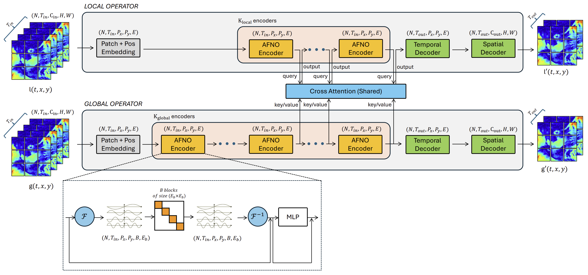

# AdaptFNO: Adaptive Fourier Neural Operator with Dynamic Spectral Modes and Multiscale Learning for Climate Modeling

[](https://neurips.cc/Conferences/2025/Schedule)

**Authors:**  
Hiep Vo Dang (Yeshiva University)
Bach D. G. Nguyen (Michigan State University)
Phong C. H. Nguyen (Phenikaa University)
Truong-Son Hy (University of Alabama at Birmingham) - Correspondence to thy@uab.edu

---

## 📖 Overview

Fourier Neural Operators (FNOs) are powerful for modeling spatio-temporal dynamics but often emphasize low-frequency patterns, overlooking fine-scale details critical in **climate forecasting**.  
We introduce **AdaptFNO**, an adaptive variant that:

- **Dynamically adjusts spectral modes** based on input frequency content.  
- **Combines global and local operators** for multiscale learning.  
- Uses a **cross-attention mechanism** to align global and local features.  

AdaptFNO effectively captures both **large-scale circulation** and **fine-grained events** such as typhoon trajectories, with efficient long-range stability.

This codebase accompanies our NeurIPS 2025 Workshop paper:  
> *\"AdaptFNO: Adaptive Fourier Neural Operator with Dynamic Spectral Modes and Multiscale Learning for Climate Modeling\"*.

---

## 📐 Architecture

The figure below illustrates the overall architecture of **AdaptFNO**:



---

## ✨ Features

- **Dynamic spectral mode allocation** to handle both low- and high-frequency structures.  
- **Multiscale design**:
  - Global operator (low-res, large-scale patterns)  
  - Local operator (high-res, fine details)  
- **Cross-attention mechanism** for efficient knowledge transfer from global to local forecasts.  
- **Validated on ERA5 reanalysis data** with case studies (e.g., Typhoon Yagi).  

---

## 📂 Repository Structure

```
AdaptFNO-main/
│
├── models/              # AdaptFNO, FNO, and baseline model definitions
├── data/                # Scripts for downloading and preprocessing ERA5 data
├── training/            # Training loop, loss functions, and optimization setup
├── utils/               # Helper functions (metrics, visualization, etc.)
├── experiments/         # Example experiment configurations
├── figures/             # Plots of results (e.g., Typhoon Yagi trajectory)
└── main.py              # Entry point for training and evaluation
```

---

## ⚙️ Installation

Clone the repository and install dependencies:

```bash
git clone https://github.com/HySonLab/AdaptFNO.git
cd AdaptFNO
pip install -r requirements.txt
```

Recommended environment:
- Python 3.9+
- PyTorch 2.0+
- CUDA 11.8+ (for GPU training)

---

## 📊 Dataset

We use the **ERA5 reanalysis dataset** (hourly data on pressure levels 250, 500, 850 hPa).  
- Download from [Copernicus Climate Data Store](https://cds.climate.copernicus.eu/).  
- Preprocessing scripts are provided in `data/`.

**Variables included:**  
- U/V wind components  
- Vertical velocity  
- Temperature  
- Relative humidity  
- Geopotential  

Data is split chronologically:  
- **Training:** 1980–2022  
- **Validation:** 2023–2024  

---

## 🚀 Usage

### Training
Run the following to train AdaptFNO:
```bash
python main.py --config configs/adaptfno.yaml
```

### Evaluation
To evaluate a trained model:
```bash
python main.py --config configs/adaptfno.yaml --eval
```

### Baseline Models
Configs for CNN and standard FNO are provided under `configs/`.

---

## 📈 Results

- **Task:** Short-term climate forecasting (3-day horizon).  
- **Metric:** Temporal Weighted MSE.  
- **Case Study:** Typhoon Yagi trajectory prediction.  

AdaptFNO shows improved accuracy in capturing cyclone formation and fine-scale atmospheric dynamics compared to FNO and CNN baselines.

---

## 🔮 Future Work

- Comprehensive benchmarks against CNN and FNO baselines.  
- Extension to other extreme events (hurricanes, heat waves, precipitation extremes).  
- Integration into operational forecasting pipelines for rapid high-resolution updates.  

---

## 📑 Citation

If you use this code, please cite our paper:

```bibtex
@inproceedings{dang2025adaptfno,
  title={AdaptFNO: Adaptive Fourier Neural Operator with Dynamic Spectral Modes and Multiscale Learning for Climate Modeling},
  author={Dang, Hiep Vo and Nguyen, Bach D.G. and Nguyen, Phong C.H. and Hy, Truong-Son},
  booktitle={NeurIPS 2025 Workshop on Machine Learning and the Physical Sciences},
  year={2025}
}
```

---

## 🤝 Acknowledgements

- ERA5 dataset (ECMWF / Copernicus Climate Data Store).  
- Fourier Neural Operator (Li et al., ICLR 2021).  
- FourCastNet (Pathak et al., 2022).  
